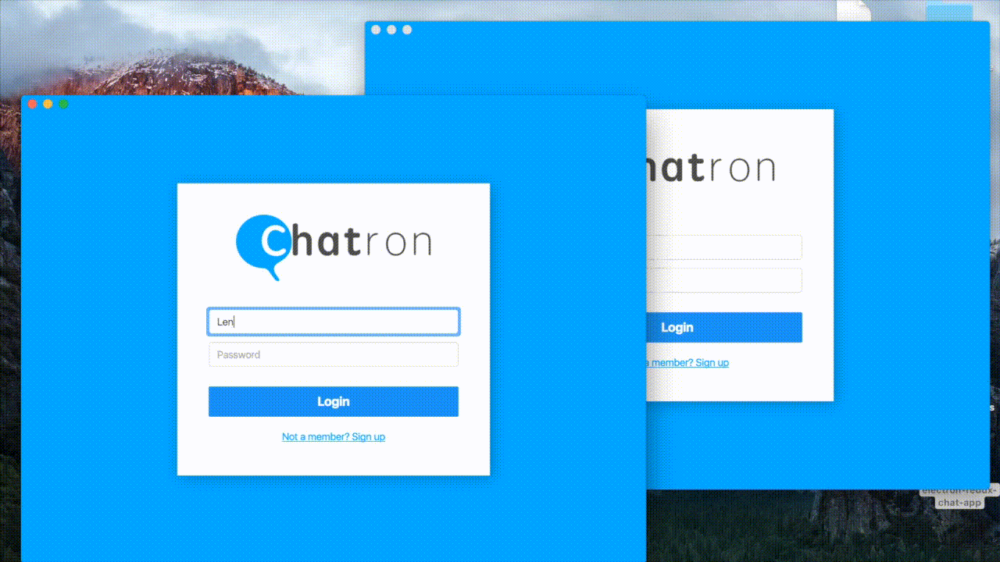

##Chatron - An Electron, React, Redux chat application



##Install

Clone this repository

`git clone https://github.com/LennyBoyatzis/Chatron.git`

##Running the Chatron Backend

To run the backend navigate into the Backend directory

```
cd Backend
```

Now install the necessary node modules with

```
npm install
```

##Running the Electron Application

Note: The backend with need to be running for the electron app to work

To run the completed version of the electron app navigate into the Complete directory

```
cd Complete
```

In two separate console tabs build and run the project with the following commands

```
npm run watch
npm start
```

In summary you should have 3 console tabs open to run this application.


